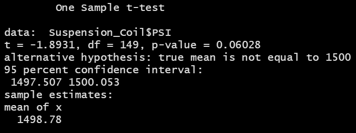

# MechaCar_Statistical_Analysis

## Purpose
The purpose of this project was to analyze data for AutosRUs’ newest prototype, the MechaCar, and review the production data for insights that may help the manufacturing team address production problems. The objectives were to:

- Perform multiple linear regression analysis to identify which variables in the dataset predict the mpg of MechaCar prototypes.
- Collect summary statistics on the pounds per square inch (PSI) of the suspension coils from the manufacturing lots.
- Run t-tests to determine if the manufacturing lots are statistically different from the mean population.
- Design a statistical study to compare vehicle performance of the MechaCar vehicles against vehicles from other manufacturers.

## Linear Regression to Predict MPG
### Linear Regression

 

### Summary of Linear Regression

 

#### Which variables/coefficients provided a non-random amount of variance to the mpg values in the dataset?

#### Is the slope of the linear model considered to be zero? Why or why not?

#### Does this linear model predict mpg of MechaCar prototypes effectively? Why or why not?

## Summary Statistics on Suspension Coils
### Total Summary

 

### Lot Summary

 

#### The design specifications for the MechaCar suspension coils dictate that the variance of the suspension coils must not exceed 100 pounds per square inch. Does the current manufacturing data meet this design specification for all manufacturing lots in total and each lot individually? Why or why not?

## T-Tests on Suspension Coils
### T-test for All Lots

 

### T-test for Lot 1

 

### T-test for Lot 2

 

### T-test for Lot 3

 

## Study Design: MechaCar vs Competition
