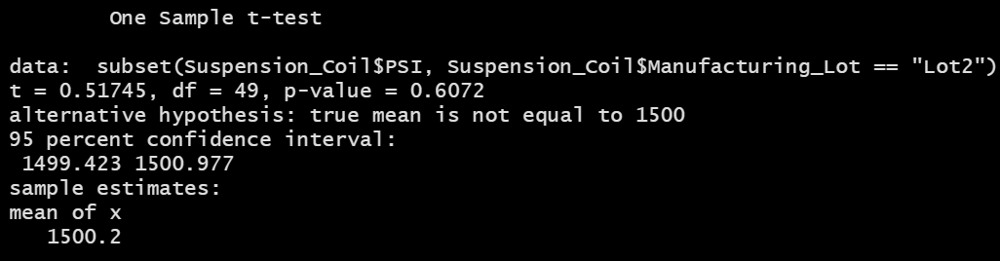

# MechaCar_Statistical_Analysis

## Purpose
The purpose of this project was to analyze data for AutosRUs’ newest prototype, the MechaCar, and review the production data for insights that may help the manufacturing team. The objectives were to:

- Perform multiple linear regression analysis to identify which variables in the dataset predict the mpg of MechaCar prototypes.
- Collect summary statistics on the pounds per square inch (PSI) of the suspension coils from the manufacturing lots.
- Run t-tests to determine if the manufacturing lots are statistically different from the mean population.
- Design a statistical study to compare vehicle performance of the MechaCar vehicles against vehicles from other manufacturers.

## Linear Regression to Predict MPG

 

## Summary Statistics on Suspension Coils
### Total Summary

 

### Lot Summary

 

## T-Tests on Suspension Coils
### T-test for All Lots

 

### T-test for Lot 1

 

### T-test for Lot 2

 

### T-test for Lot 3

 

## Study Design: MechaCar vs Competition
