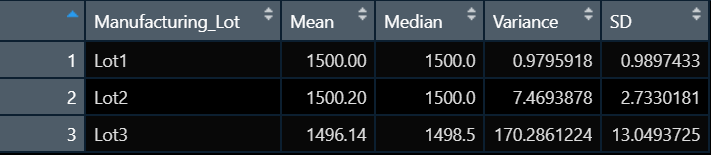

# MechaCar_Statistical_Analysis

## Linear Regression to Predict MPG

 

## Summary Statistics on Suspension Coils
### Total Summary

 

### Lot Summary

 

## T-Tests on Suspension Coils
### T-test for All Lots

 

### T-test for Lot 1

 

### T-test for Lot 2

 

### T-test for Lot 3

 

## Study Design: MechaCar vs Competition
