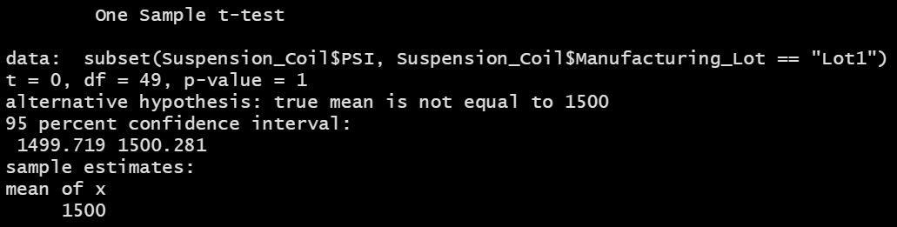

# MechaCar_Statistical_Analysis

## Purpose
The purpose of this project was to analyze data for AutosRUs’ newest prototype, the MechaCar, and review the production data for insights that may help the manufacturing team address production problems. The objectives were to:

- Perform multiple linear regression analysis to identify which variables in the dataset predict the mpg of MechaCar prototypes.
- Collect summary statistics on the pounds per square inch (PSI) of the suspension coils from the manufacturing lots.
- Run t-tests to determine if the manufacturing lots are statistically different from the mean population.
- Design a statistical study to compare vehicle performance of the MechaCar vehicles against vehicles from other manufacturers.

## Resources
- Data sources: [MechaCar_mpg.csv](Resources/MechaCar_mpg.csv); [Suspension_Coil.csv](Resources/Suspension_Coil.csv)
- Software: RStudio version 1.4.1106

## Linear Regression to Predict MPG
### Figure 1: Linear Regression

 

### Figure 2: Summary of Linear Regression

 

#### Which variables/coefficients provided a non-random amount of variance to the mpg values in the dataset?
The variables that provided a non-random amount of variance are vehicle length and ground clearance, as the p-values for these variables are less than 0.05. A p-value less than or equal to 0.05 is a strong indication of a non-random sample and provides evidence that the null hypothesis should be rejected. This would mean that there is a relationship between mpg and vehicle length, and mpg and ground clearance.

#### Is the slope of the linear model considered to be zero? Why or why not?
The slope of the linear model is not zero, but it is close. This can be determined by examining the estimated values, none of which equal zero, and the p-value, which is less than 0.05 at 5.35e-11 (Figure 2).

#### Does this linear model predict mpg of MechaCar prototypes effectively? Why or why not?
The linear model does predict the mpg of prototype effectively, but it can be improved. An R-squared value that is closer to 1 indicates that a large proportion of the variability in the outcome has been explained by the regression model (Kassambara, et al., 2018). The R-squared value is 0.7149 (Figure 2), demonstrating that the model is pretty effective.

## Summary Statistics on Suspension Coils
### Figure 3: Total Summary

 

### Figure 4: Lot Summary

 

#### The design specifications for the MechaCar suspension coils dictate that the variance of the suspension coils must not exceed 100 pounds per square inch. 

#### Does the current manufacturing data meet this design specification for all manufacturing lots in total? Why or why not?
The current manufacturing data does meet design specifications for all manufacturing lots in total. In Figure 3, we can see that the variance is 62.29, which is less than 100.

#### Does the current manufacturing data meet this design specification for each lot individually? Why or why not?
The current manufacturing data meets the design specifications in Lot 1 and Lot 2, as the variance is 0.97 for Lot 1 and 7.47 for Lot 2 (Figure 4). The manufacturing data for Lot 3 does not meet design specifications, with a variance of 170 (Figure 4).

## T-Tests on Suspension Coils
### Figure 5: T-test for All Lots

 
 
According to the results in Figure 5, the p-value 0.06028 is greater than the significance level 0.05. At 95% confidence level, the PSI across all manufacturing lots is NOT statistically different from the population mean of 1,500 pounds per square inch. There is failure to reject the null hypothesis.

### Figure 6: T-test for Lot 1

 
 
Per Figure 6, the p-value of 1 is greater than the significance level 0.05. At 95% confidence level, the PSI for Lot 1 is NOT statistically different from the population mean of 1,500 pounds per square inch. There is failure to reject the null hypothesis.

### Figure 7: T-test for Lot 2

 
 
Per Figure 7, the p-value of 0.6072 is greater than the significance level 0.05. At 95% confidence level, the PSI for Lot 2 is NOT statistically different from the population mean of 1,500 pounds per square inch. There is failure to reject the null hypothesis.

### Figure 8: T-test for Lot 3

 
 
Per Figure 8, the p-value of 0.04168 is less than the significance level 0.05. At 95% confidence level, the PSI for Lot 3 is statistically different from the population mean of 1,500 pounds per square inch. The null hypothesis can be rejected.

## Study Design: MechaCar vs Competition
The purpose of this statistical study is to compare average fuel efficiency of the MechaCar vehicles against that of vehicles from another manufacturer. The average fuel efficiency of MechaCar vehicles and its competitor's cars will be needed to perform the statistical analysis. The null hypothesis would state that there is no significant difference of average fuel efficiency between MechaCar vehicles and its competitor. The alternative hypothesis would state that there is a significant difference of average fuel efficiency between MechaCar vehicles and its competitor. To test the hypothesis, a two-sample t-test would be performed to determine if the two population means are equal or not. To perform this test, summary statistics would be performed to get the mean and standard deviation. The p-value obtained from the t-test would help to determine if the average fuel efficiency of the companies are significantly different- p < 0.05 is statistically significant and indicates strong evidence against the null hypothesis; p > 0.05 is not statistically significant and indicates strong evidence for the null hypothesis (Mcleod, 2019).

## References
1. Kassambara, Stevesmith, R-Stats, Ratnam, Visitor, Kassambara, . . . Visitor, J. (2018, March 11). Linear regression essentials in R. Retrieved March 19, 2021, from http://www.sthda.com/english/articles/40-regression-analysis/165-linear-regression-essentials-in-r/
2. Mcleod, S. (2019). Value and statistical significance: Simply psychology20. Retrieved March 19, 2021, from https://www.simplypsychology.org/p-value.html
